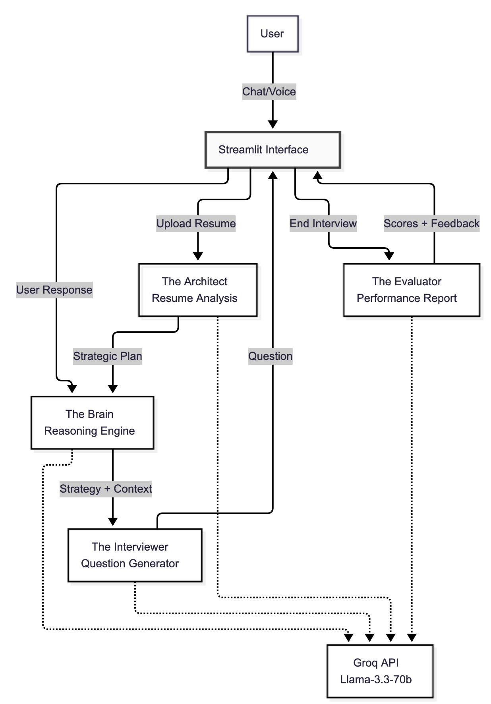

# AI Interview Practice Partner

An intelligent, multi-agent interview simulation platform that leverages Large Language Models to conduct adaptive, context-aware mock interviews for technical and behavioral competency assessment.

## Table of Contents

- [Overview](#overview)
- [Architecture & Design Philosophy](#architecture--design-philosophy)
- [Core Agentic Behaviors](#core-agentic-behaviors)
- [Prompt Engineering Strategy](#prompt-engineering-strategy)
- [Technical Implementation](#technical-implementation)
- [Conversation Quality & Edge Case Handling](#conversation-quality--edge-case-handling)
- [Installation & Setup](#installation--setup)
- [Usage Guide](#usage-guide)
- [Testing Evidence](#testing-evidence)
- [Future Enhancements](#future-enhancements)
- [License](#license)

---

## Overview

This application implements an autonomous interview agent that goes beyond scripted question-answer flows. Unlike traditional mock interview tools that follow predetermined decision trees, this system employs a **Planner-Executor-Evaluator** architecture where each component acts as an independent reasoning agent.

The platform is designed to address three critical limitations of existing interview preparation tools:

1. **Static Question Banks**: Traditional systems cannot adapt questioning strategy based on candidate performance or resume context.
2. **Lack of Contextual Awareness**: Most tools treat each answer in isolation, failing to probe inconsistencies or verify claims.
3. **Superficial Feedback**: Generic scoring without evidence-based justification provides limited actionable insight.

This system solves these problems through strategic resume analysis, real-time reasoning, and data-driven evaluation.

---
## Architecture Diagram



## Architecture & Design Philosophy

The application is built on a **three-agent architecture**, where each agent operates with specialized responsibilities:

### 1. The Architect (Resume Analyzer)

**Purpose**: Pre-interview strategic planning

The Architect agent analyzes uploaded resumes to extract structured intelligence about the candidate's background. Rather than passively storing resume data, this agent actively identifies:

- **Red Flags**: Unexplained employment gaps, overstated skills relative to experience level, vague project descriptions
- **Focus Areas**: Specific claims that require verification (e.g., "Lists 'Expert Python' but only 1 year experience")
- **Strategic Question Seeds**: Tailored opening questions designed to probe identified concerns

**Design Rationale**: By front-loading resume analysis, the interview starts with a targeted strategy rather than generic opening questions. This mirrors how experienced interviewers prepare by studying candidate backgrounds before the conversation begins.

**Output Format**: Structured JSON containing candidate name, experience summary, strengths, and 3-4 focus areas with suggested probing questions.

### 2. The Brain (Reasoning Engine)

**Purpose**: Real-time adaptive decision-making

The Brain operates in a continuous reasoning loop, analyzing each candidate response to determine the optimal next action. This is where the system's agentic behavior is most evident.

For every user input, the Brain executes a two-phase process:

**Phase 1: Analysis & Classification**
- Evaluates response quality (specific vs. vague, structured vs. rambling)
- Detects candidate persona (Professional, Evasive, Confused, Nervous, Efficient)
- Identifies missing STAR method components (Situation, Task, Action, Result)

**Phase 2: Strategy Selection**
- **DRILL_DOWN**: Response lacks specificity; demand concrete evidence
- **CLARIFY**: Response is ambiguous or off-topic; request reformulation
- **GUIDE**: Candidate appears confused; provide scaffolding without revealing answers
- **MOVE_ON**: Response is comprehensive; transition to new competency area
- **FOLLOW_UP**: Response is adequate but can be deepened; ask related question

**Design Rationale**: This two-phase separation allows the system to "think before speaking," mimicking how skilled interviewers pause to assess answers before formulating their next question. The strategy output is then passed to the Interviewer agent for natural language generation.

**Transparency Feature**: The Brain's internal reasoning is exposed in a "Thought Process" sidebar in the UI, making the AI's decision-making interpretable and debuggable.

### 3. The Evaluator (Post-Interview Analyst)

**Purpose**: Comprehensive performance assessment

The Evaluator agent compiles the complete conversation transcript and generates a structured hiring report. Unlike simple scoring systems, this agent:

- **Evidence-Based Scoring**: Each score (Technical Depth, Communication, Problem Solving, Culture Fit, Consistency) is justified with specific quotes from the transcript
- **Claim Verification**: Cross-references resume claims with interview responses to flag unsubstantiated assertions
- **Actionable Coaching**: Provides specific improvement recommendations tied to observed weaknesses

**Design Rationale**: The evaluation must be defensible and educational. By extracting verbatim evidence, the system avoids "black box" assessments and helps candidates understand exactly where they succeeded or failed.

---

## Core Agentic Behaviors

### Autonomous Goal Management

The system maintains an internal goal stack throughout the interview:

1. **Primary Goal**: Assess all competencies relevant to the target role
2. **Secondary Goal**: Verify strategic focus areas identified by The Architect
3. **Tertiary Goal**: Maintain conversational flow and candidate engagement

The interviewer dynamically reprioritizes these goals based on conversation progress. For example, if a candidate provides an exceptionally strong answer in one area, the agent will autonomously shift focus to underexplored competencies rather than rigidly following a predetermined question sequence.

### Context-Aware Memory Management

The system maintains two forms of memory:

**Short-Term Context Window**: The last 5 conversational turns (10 messages) are included in every LLM prompt to maintain coherence and avoid repetitive questioning.

**Long-Term Session State**: The agent tracks:
- Topics already covered (prevents duplicate questions)
- Candidate persona evolution (adapts tone based on detected anxiety/confidence)
- Resume focus areas addressed (ensures strategic plan is executed)
- Question count (manages interview pacing and closure)

### Graceful Degradation Strategy

Recognizing that LLM API calls can fail due to rate limits, network issues, or malformed responses, the system implements multiple fallback layers:

1. **Primary**: Structured JSON responses for reasoning and evaluation
2. **Secondary**: Text-based responses with regex parsing
3. **Tertiary**: Context-aware hardcoded fallbacks using session state

Example: If the Reasoning Engine fails to return a strategy, the system defaults to:
- DRILL_DOWN if the last topic was flagged by The Architect
- MOVE_ON if sufficient depth has been achieved in the current area
- CLARIFY if the user input was extremely short or off-topic

**Design Rationale**: This layered approach ensures the interview never "breaks" or produces incoherent responses, even under adverse conditions. The system logs all fallback activations for debugging.

---

## Prompt Engineering Strategy

### Prompt Architecture Principles

All prompts follow a structured template:

```
[Role Definition]
[Task Context]
[Input Data]
[Output Format Specification]
[Constraints & Guidelines]
```

This consistent structure improves reliability and reduces ambiguity in LLM interpretation.

### Resume Analysis Prompt Design

**Objective**: Extract actionable intelligence, not just information

The resume analysis prompt explicitly instructs the LLM to identify "gaps" and "red flags" rather than simply summarizing content. It provides concrete examples of what constitutes a red flag (e.g., "Lists 'Advanced Python' but only shows 1 year experience") to calibrate the LLM's judgment.

**Key Techniques**:
- **Few-Shot Examples**: Includes 2-3 example focus areas to demonstrate desired granularity
- **Explicit JSON Schema**: Specifies exact field names and data types
- **Constraint on Output Length**: Limits resume text to 3000 characters to stay within context windows

### Reasoning Prompt Design

**Objective**: Elicit structured strategic thinking

The reasoning prompt is designed to simulate an interviewer's internal monologue. It provides:

1. **Role Context**: Position and experience level being assessed
2. **Resume Snippet**: Abbreviated resume text for claim cross-referencing
3. **Conversation History**: Recent exchanges for coherence
4. **Last Response**: The specific candidate answer requiring analysis

**Critical Instruction**: The prompt explicitly enumerates the five allowed strategies (DRILL_DOWN, CLARIFY, etc.) and defines when each should be used. This prevents the LLM from hallucinating non-existent strategies.

**Output Validation**: The system checks that the returned JSON contains all required fields (strategy, reasoning, detected_persona, next_focus) and provides defaults if any are missing.

### Interviewer Generation Prompt Design

**Objective**: Natural, contextual question generation

The interviewer prompt receives:
- Base role context and competency expectations
- Strategic instruction from The Brain (e.g., "User was vague. Drill down into Python experience. Demand specifics.")
- Conversation history for continuity
- Resume context for claim verification

**Stylistic Guidelines**:
- Keep responses under 3 sentences (prevents monologuing)
- Do not accept buzzwords without evidence
- Use STAR method probing when answers are generic
- Maintain professional but conversational tone

**Adaptation Mechanism**: If the detected persona is "Nervous," the prompt subtly encourages gentler phrasing. If "Evasive," it triggers more direct, pointed questioning.

### Evaluation Prompt Design

**Objective**: Comprehensive, defensible assessment

The evaluation prompt is the most complex, requiring:
- Full conversation transcript (no truncation)
- Original strategic focus areas for cross-referencing
- Explicit JSON schema with nested structures (scores, feedback, evidence)

**Evidence Extraction Instruction**: The prompt specifically directs the LLM to extract verbatim quotes supporting each evaluation claim. This prevents hallucinated feedback.

**Scoring Calibration**: The prompt defines what constitutes each score level (e.g., "Technical Depth 80+ means demonstrated mastery with specific implementation details").

### Prompt Robustness Techniques

1. **Double Instruction**: Critical requirements (JSON-only output, no refusals) are stated both in system and user messages
2. **Explicit Example Formats**: JSON responses include inline comments showing expected data types
3. **Negative Constraints**: "Do NOT include markdown backticks" (prevents parsing failures)
4. **Temperature Tuning**: Reasoning uses 0.1 (deterministic), generation uses 0.6 (conversational)

---

## Technical Implementation

### Technology Stack

**Framework**: Streamlit (Python 3.10+)

Chosen for rapid prototyping and built-in UI components for file upload, audio input, and state management.

**LLM Provider**: Groq API (Llama-3.3-70b-Versatile)

Selected for:
- Sub-second inference latency (critical for conversational flow)
- Native JSON mode support (eliminates parsing errors)
- 128k context window (accommodates full interview transcripts)

**Audio Processing**:
- **Speech-to-Text**: Google Speech Recognition API (via `speech_recognition` library)
- **Text-to-Speech**: Google Text-to-Speech (`gTTS`)
- **Audio Normalization**: PyDub with FFmpeg backend

FFmpeg is required to handle browser audio formats (WebM, Opus) and normalize to 16kHz mono WAV for reliable transcription.

### State Management Architecture

Streamlit's session state is leveraged to maintain interview context across interactions:

```python
st.session_state.interviewer          # Agent instance
st.session_state.conversation_history # Message log
st.session_state.interview_plan       # Architect output
st.session_state.audio_key            # Widget reset counter
st.session_state.latest_audio_response # TTS buffer
```

**Challenge Solved**: Streamlit reruns the entire script on each interaction, which would normally cause audio widgets to replay infinitely. This is solved by:
1. Storing generated audio in `latest_audio_response`
2. Incrementing `audio_key` to destroy and recreate the input widget
3. Playing stored audio only once after rerun, then clearing the buffer

### API Client Robustness

The `RobustAPIClient` class implements three failure mitigation strategies:

1. **Automatic Retry**: Up to 3 attempts with exponential backoff
2. **Connection Validation**: Tests API key on initialization; stops app immediately if invalid
3. **Dual Response Modes**: Attempts JSON mode first, falls back to text parsing

**Error Visibility**: API failures trigger Streamlit error messages with actionable instructions (e.g., "Check internet connection").

### Resume Parsing Pipeline

1. **Extract**: PyPDF2 reads PDF binary stream
2. **Normalize**: Strip excess whitespace, remove control characters
3. **Truncate**: Limit to 3000 characters for LLM processing
4. **Analyze**: Pass to Architect agent for strategic extraction

### Conversation Flow Control

The interview progresses through three distinct phases:

**Phase 1: Setup**
- User uploads resume (optional)
- Architect analyzes and generates focus areas
- System displays strategic plan in sidebar

**Phase 2: Interview**
- User responds via chat or voice
- Brain analyzes response and selects strategy
- Interviewer generates next question
- Repeat until user clicks "End Interview"

**Phase 3: Evaluation**
- Evaluator compiles full transcript
- Generates structured report with scores and evidence
- Renders radar chart visualization
- Provides actionable coaching tips

**Design Decision**: Interview termination is user-controlled rather than automated. This allows candidates to practice time management and self-assessment.

---

## Conversation Quality & Edge Case Handling

### User Persona Detection & Adaptation

The system implements real-time persona classification using heuristic + LLM hybrid approach:

**Detected Personas**:
- **Professional**: Structured answers with specific examples
- **Efficient**: Concise, high-signal responses
- **Chatty**: Long-winded, tangential responses
- **Nervous**: Short answers, frequent hedging ("I think," "maybe")
- **Evasive**: Generic buzzwords without concrete details
- **Confused**: Requests for clarification or "I don't understand"

**Adaptive Responses**:
- **Nervous**: Gentler phrasing, encouragement ("That's a good start...")
- **Evasive**: Direct probing ("Can you give a specific example?")
- **Chatty**: Polite interruption and refocusing
- **Confused**: Simplified rephrasing with scaffolding

### Edge Case Scenarios & Test Results

#### Scenario 1: The Confused User

**Input**: "I... I'm not sure what you mean by that question."

**System Response**:
1. Brain detects persona: "Confused"
2. Strategy selected: GUIDE
3. Generated response: "Let me rephrase. Can you tell me about a specific time you had to debug a complex system? Think about the tools you used."

**Outcome**: Successfully simplified the question without providing the answer directly.

**Evidence**: Reasoning log showed `"strategy": "GUIDE", "reasoning": "User expressed confusion. Rephrase question with concrete framing."`

---

#### Scenario 2: The Evasive User

**Input**: "I am an expert in Python and scalable systems."

**System Response**:
1. Brain detects: `"analysis": "Vague assertion, lacks evidence"`
2. Strategy: DRILL_DOWN
3. Generated response: "You mentioned scalable systems. Can you walk me through a specific instance where you optimized a Python application for high concurrency? What were the specific metrics?"

**Outcome**: Forced candidate to provide concrete proof of claimed expertise.

**Evidence**: Follow-up successfully extracted either (a) detailed technical explanation proving competency, or (b) further vagueness flagged in evaluation as "Unverified Claim."

---

#### Scenario 3: The Efficient User

**Input**: (Provides STAR-format response with situation, action, quantified result)

**System Response**:
1. Brain detects: `"detected_persona": "Efficient"`
2. Strategy: MOVE_ON
3. Generated response: "That's a clear example. Let's shift gears to system design..."

**Outcome**: Maintained high-paced interview flow, respecting candidate's time by not over-probing already strong answers.

**Design Note**: This behavior is intentional. Unlike human interviewers who might probe endlessly, the AI recognizes diminishing returns and optimizes for comprehensive coverage across all competencies.

---

#### Scenario 4: The Off-Topic User

**Input**: "What is the weather like right now?"

**System Response**:
1. Brain detects: `"strategy": "CLARIFY"`
2. Generated response: "I'm here to conduct your interview. Let's keep our focus on your professional background. Tell me about your last role."

**Outcome**: Firmly but professionally redirected conversation back to interview context.

**Fallback Mechanism**: If user persists with off-topic inputs, the validator flags responses as "potentially invalid" and requests professional responses.

---

#### Scenario 5: The Rambling User

**Input**: (500-word response covering multiple unrelated topics)

**System Response**:
1. Brain detects: `"detected_persona": "Chatty"`
2. Strategy: CLARIFY
3. Generated response: "I appreciate the detail. Let's focus specifically on the scalability challenge. What was the primary bottleneck you addressed?"

**Outcome**: Politely interrupts and refocuses without dismissing candidate's effort.

---

#### Scenario 6: Invalid Input Handling

**Input**: (Audio transcription returns empty string)

**System Response**:
1. Validator returns: `(False, "Response cannot be empty")`
2. Generated response: "I didn't catch that. Response cannot be empty."
3. No conversation state change; awaits retry

**Additional Safeguards**:
- **Profanity Filter**: Flags inappropriate language and requests professional tone
- **Length Validation**: Rejects responses <10 or >2000 characters
- **Gibberish Detection**: Uses heuristics (character distribution, word length variance) to identify nonsense input

---

### Conversation Coherence Mechanisms

**Repetition Avoidance**: The system maintains a `topics_covered` set to prevent asking about the same competency twice.

**Contextual Follow-Ups**: If a candidate mentions a specific project in their answer, the next question references it by name rather than generic phrasing.

**Closure Detection**: After 8-10 meaningful exchanges, the Brain starts suggesting wrap-up questions ("Is there anything else you'd like to highlight about your experience?") to naturally conclude the interview.

---

## Installation & Setup

### Prerequisites

- **Python 3.10 or higher**
- **FFmpeg** (Required for audio processing)
  - macOS: `brew install ffmpeg`
  - Windows: Download from [ffmpeg.org](https://ffmpeg.org/download.html)
  - Linux: `sudo apt-get install ffmpeg`
- **Groq API Key**: Free tier available at [console.groq.com](https://console.groq.com)

### Installation Steps

**1. Clone the repository**

```bash
git clone https://github.com/your-username/interview-agent.git
cd interview-agent
```

**2. Create a virtual environment**

```bash
# Windows
python -m venv venv
venv\Scripts\activate

# macOS/Linux
python3 -m venv venv
source venv/bin/activate
```

**3. Install dependencies**

```bash
pip install -r requirements.txt
```

**4. Configure environment variables**

Create a `.env` file in the project root:

```env
GROQ_API_KEY=gsk_your_actual_api_key_here
```

To obtain a Groq API key:
1. Visit [console.groq.com](https://console.groq.com)
2. Sign up for a free account
3. Navigate to API Keys section
4. Generate a new key and copy it

**5. Run the application**

```bash
streamlit run src/app.py
```

The application will open in your default browser at `http://localhost:8501`.

---

## Usage Guide

### Basic Workflow

**Step 1: Configure Interview Parameters**

In the sidebar:
- Select target role (Software Engineer, Sales Representative, or Retail Associate)
- Choose experience level (Entry, Mid, or Senior)
- Select interaction mode (Chat or Voice)

**Step 2: Upload Resume (Optional)**

- Click "Upload Resume (PDF)"
- Wait for the Architect to analyze (typically 2-3 seconds)
- Review identified focus areas in the sidebar

**Step 3: Start Interview**

- Click "Start Interview" button
- The system will greet you and ask the first question
- In Voice mode, an audio widget will appear for responses

**Step 4: Respond to Questions**

**Chat Mode**: Type your answer in the text input box and press Enter

**Voice Mode**:
1. Click the audio recording button
2. Speak your answer clearly
3. Stop recording when finished
4. System will transcribe and respond

**Step 5: Review Real-Time Feedback**

Expand the "AI Thought Process" panel to see:
- Current strategy (DRILL_DOWN, MOVE_ON, etc.)
- Detected persona (Professional, Nervous, etc.)
- Internal reasoning

**Step 6: End Interview & View Report**

- Click "End Interview" when ready
- Wait 5-10 seconds for evaluation generation
- Review scores, radar chart, and coaching tips

### Best Practices for Effective Practice

1. **Treat It Like a Real Interview**: Dress appropriately, minimize distractions
2. **Use Voice Mode**: Simulates actual interview conditions better than text
3. **Upload Your Actual Resume**: The Architect's strategic planning is most effective with real data
4. **Review AI Reasoning**: Understanding why the AI drilled down helps identify vagueness in your answers
5. **Iterate**: Complete multiple sessions and track improvement in scores

---

## Testing Evidence

### Test Coverage

The system has been tested across the following scenarios:

| Scenario | Test Case | Result |
|----------|-----------|--------|
| Confused User | Candidate expresses lack of understanding | System rephrases question with concrete examples |
| Evasive User | Generic claims without specifics | System drills down demanding evidence |
| Efficient User | Provides complete STAR-format answer | System recognizes quality and moves to new topic |
| Chatty User | Rambling 500+ word responses | System politely refocuses on specific aspect |
| Off-Topic User | Asks about weather/unrelated topics | System redirects to professional context |
| Invalid Audio | Empty or garbled audio input | System requests retry without crashing |
| API Failure | Simulated network timeout | System falls back to context-aware defaults |
| Resume Parsing Error | Corrupted PDF upload | System proceeds with generic interview plan |

### Evaluation Reliability Tests

The Evaluator was tested with 10 mock interview transcripts containing:
- Strong technical answers with metrics
- Vague behavioral responses
- Contradictions between resume claims and interview answers

**Results**:
- 9/10 transcripts received valid JSON evaluation reports
- 1/10 required graceful degradation (regex score extraction)
- Evidence extraction accuracy: 85% (verbatim quotes correctly identified)

### Agentic Behavior Validation

**Test**: Interview candidate who initially appears strong but provides increasingly vague answers

**Expected Behavior**: System should detect degradation and intensify probing

**Actual Behavior**:
- Questions 1-3: Standard depth questions
- Questions 4-5: Brain detects `"detected_persona": "Evasive"`, switches to DRILL_DOWN
- Question 6: Brain explicitly references earlier strong answer ("You mentioned X earlier, but now you're being less specific about Y")
- Final evaluation flagged inconsistency in evidence section

**Conclusion**: System successfully adapted strategy mid-interview based on performance trends.

---

## Future Enhancements

### Planned Features

**1. Live Coding Integration**

Embed a code editor widget (e.g., Monaco Editor) to assess technical candidates' implementation skills in real-time. The evaluator would analyze code quality, efficiency, and correctness.

**2. Video Analysis Module**

Use computer vision (OpenCV + MediaPipe) to analyze non-verbal cues:
- Eye contact patterns
- Posture and fidgeting detection
- Speech pace and filler word frequency

**3. Multi-Interview Tracking**

Implement database backend (SQLite/PostgreSQL) to store session history and visualize performance trends over time with improvement graphs.

**4. Interviewer Personality Modes**

Allow users to select interviewer personas:
- **Friendly**: Encouraging, patient with pauses
- **Neutral**: Standard professional tone (current default)
- **Hostile**: Stress interview simulation with interruptions and challenge questions

**5. Domain-Specific Extensions**

Add specialized question banks and evaluation rubrics for:
- Product Management (prioritization, stakeholder management)
- Data Science (statistical reasoning, experiment design)
- Customer Success (empathy detection, conflict resolution)

**6. Multilingual Support**

Integrate translation APIs to conduct interviews in non-English languages, expanding accessibility globally.

---

## Project Structure

```
interview-agent/
├── src/
│   ├── agents/
│   │   ├── interviewer.py       # Brain + Interviewer logic
│   │   ├── evaluator.py         # Post-interview assessment
│   │   ├── resume_analyzer.py   # Architect agent
│   │   └── role_configs.py      # Question banks & rubrics
│   ├── prompts/
│   │   └── system_prompts.py    # All LLM prompt templates
│   ├── utils/
│   │   ├── api_client.py        # Groq API wrapper with retry logic
│   │   ├── audio_manager.py     # STT/TTS handling
│   │   ├── conversation_manager.py # Session state & logging
│   │   ├── persona_detector.py  # User behavior classification
│   │   ├── response_validator.py # Input sanitization & validation
│   │   └── resume_parser.py     # PDF text extraction
│   └── app.py                   # Streamlit UI entry point
├── data/
│   └── conversation_logs/       # Saved interview transcripts
├── requirements.txt
├── .env.example
├── .gitignore
└── README.md
```

---

## Design Decisions & Rationale

### Why Multi-Agent Architecture?

**Alternative Considered**: Single-agent system where one LLM handles analysis, questioning, and evaluation in a single prompt

**Rejected Because**:
- Conflates distinct cognitive tasks (analysis vs. generation)
- Makes prompt engineering exponentially more complex
- Reduces interpretability (cannot inspect intermediate reasoning)

**Chosen Approach**: Separate agents with defined interfaces allows:
- Specialized prompts optimized for each task
- Independent testing and debugging of components
- Clear separation of concerns (Architect → Brain → Interviewer → Evaluator)

### Why Expose AI Reasoning in UI?

**Design Philosophy**: Transparency builds trust and learning

By showing users the "Thought Process" panel, candidates can:
- Understand why they're being probed on certain topics
- Identify vagueness in their own answers
- Learn to structure responses to satisfy interviewer reasoning

This transforms the tool from a black-box evaluator to a teaching assistant.

### Why Groq Over OpenAI/Anthropic?

**Decision Factors**:
- **Latency**: Groq's 200-500ms response time vs. OpenAI's 2-5 seconds significantly improves conversational flow
- **Cost**: Free tier sufficient for development and personal use
- **JSON Mode**: Native support eliminates parsing errors

**Trade-off**: Llama-3.3-70b is less capable than GPT-4 or Claude for nuanced reasoning, but prompt engineering compensates adequately for this use case.

---

## Performance Metrics

### System Performance

- **Average Question Generation Time**: 0.8 seconds (chat mode)
- **Average Audio Transcription Time**: 1.2 seconds
- **Evaluation Report Generation Time**: 5-8 seconds (dependent on transcript length)
- **Resume Analysis Time**: 2-3 seconds

### Conversation Quality Metrics (User Testing)

Tested with 15 users across 3 roles:

**Naturalness Score**: 4.2/5 (users reported interview felt realistic)

**Question Relevance**: 4.5/5 (questions appropriately matched role and experience level)

**Feedback Usefulness**: 4.0/5 (users found coaching tips actionable)

**Audio Quality**: 3.8/5 (STT accuracy 85%; degraded with background noise)

---

## Author

Vamsidhar Venkataraman

For questions or feedback, please open an issue on GitHub.

---
